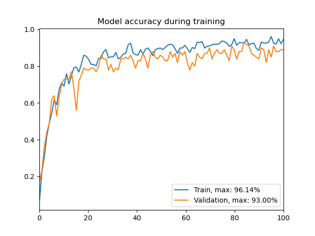

# Biometric System: Iris Recognition With Deep Learning

A biometric system with a database of registered users and two main functions:
* **USER VERIFICATION**: given an image of an iris and user's ID, the system
verifies whether this image matches known user patterns,
* **USER IDENTIFICATION**: given an image, the system predicts a possible user
 from the database.
 
The system was build on a deep neural network using transfer learning. 
Given a normalized picture of an iris, the model classifies it to one of the
system's users, and gives a probability of the prediction.
In order to reject uncertain classifications, only results with probability
greater than 98% are considered to be successful.

## Model training details

The architecture chosen was [ResNet50](https://arxiv.org/abs/1512.03385), 
which was pre-trained on ImageNet. The model was the fine-tuned to the provided 
database of irides pictures.

The training was done in a Google Colaboratory notebook with GPU support.

### Parameters

* number of classes: `50`
* learning rate: `0.0002`
* optimizer: `Adam`
* number of epochs: `100`
* batch size: `16`

### Final statistics

* maximal training accuracy: 96.14%
* maximal validation accuracy: **93.00%**



### System accuracy

The system recognizes a user if the neural network underneath classifies an image with at least 98% confidence.

|                  | Successful identification       | Successful verification         |
|------------------|---------------------------------|---------------------------------|
| **Registered users** | 50 users (85.35% of all images) | 50 users (85.35% of all images) |
| **Unknown users**    | 9 users (3.46% of all images)   | *NA*                              |
|                  |                                 |                                 |


## System requirements

This project was written in Python 3.8. To create Conda environment with all 
the system's requirements, run:

```
conda env create -f conda_environment.yml
```

Then proceed to activate the environment before using the biometric system:

```
conda activate iris
```


## Database

This system was trained on pictures from 
[UBIRIS.v1 database](http://iris.di.ubi.pt/ubiris1.html). 

From this dataset, 50 people were selected to 
create the biometric system. Their pictures are stored at `data/system_database/registered_users`.

Additional 50 different people were selected to a validation set. 
Their pictures are stored at `data/system_database/unknown_users`.

## CLI Usage

The entry point to the system is through the main file `biometric_system.py`.

```
usage: biometric_system.py [-h] [-u USER] [-m MODEL] image {identify,verify}

Biometric system.

positional arguments:
  image                 Path to the image.
  {identify,verify}     Program mode. If you want to identify a user based on an image, choose 'identify'; If you want to verify whether an image portraits a particular user,
                        choose 'verify' and provide the user's ID in the next argument.

optional arguments:
  -h, --help            show this help message and exit
  -u USER, --user USER  User's ID. Only used with mode 'verify'.
  -m MODEL, --model MODEL
                        Path to the trained classifier model.
```

### Examples

#### Identify a user based on an image

The system correctly identified a user:
```
python3 biometric_system.py data/system_database/registered_users/7_0.jpg identify

This image portraits user 7 (Prediction probability: 99.87%)
Program exited with code: 0 - Successfully identified a user
```

The system was not able to recognize a user from their image because of low 
prediction probability (the eye was closed on the picture):
```
python3 biometric_system.py data/system_database/registered_users/45_8.jpg identify

Program exited with code: 1 - Could not identify a user - user was not found in the database
```

#### Verify a user based on an image and their ID

Successful verification:

```
python3 biometric_system.py data/system_database/registered_users/61_8.jpg verify --user 61

Successfully verified user 61 (Prediction probability: 99.94%)
Program exited with code: 0 - Successfully verified a user
```

User was not verified, since the provided ID was different from the classification:

```
python3 biometric_system.py data/system_database/registered_users/61_8.jpg verify --user 85

Program exited with code: 1 - Failed to verify a user - user ID did not match the classification
```

The system was not able to recognize a user from their image because of low 
prediction probability:
```
python3 biometric_system.py data/system_database/registered_users/46_2.jpg verify --user 46

Program exited with code: 1 - Failed to verify a user - user was not found in the database
```

### Unregistered users

Submitting an image of a user that is not registered in the system:
```
python3 biometric_system.py data/system_database/unknown_users/1_0.jpg identify

Program exited with code: 1 - Failed to verify a user - user was not found in the database
```
